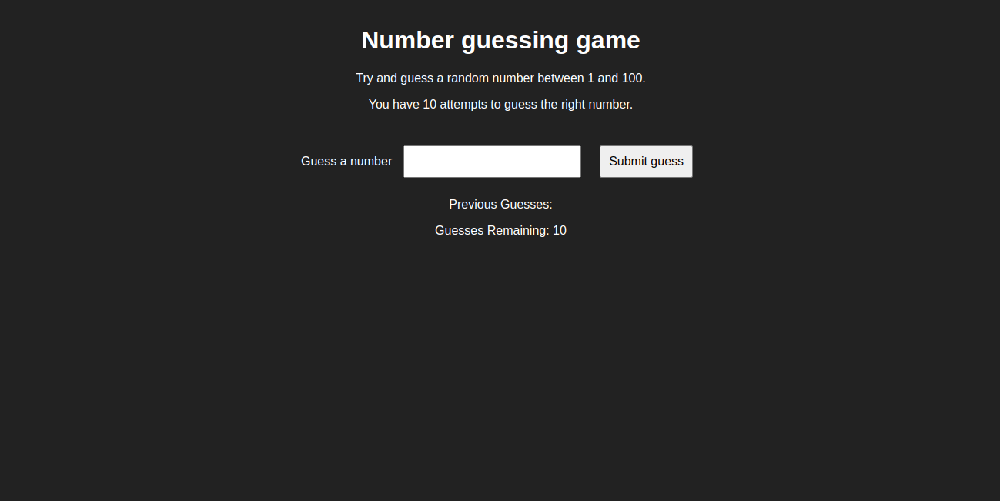

# 🎯 Number Guessing Game

A fun and interactive number guessing game built using **HTML**, **CSS**, and **Vanilla JavaScript**. The player has to guess a random number between 1 and 100 within 10 attempts.

---

## 🚀 Live Demo

[Click here to play the game!]

---

## 🛠️ Tech Stack

- HTML5
- CSS3
- JavaScript (Vanilla)

---

## 🎮 How to Play

1. Enter a number between **1 and 100**.
2. Click the **Submit** button.
3. Receive feedback:
   - `Too low 📉`
   - `Too high 📈`
   - `Correct 🎉`
4. You have a maximum of **10 guesses**.
5. Game ends if guessed correctly or after 10 attempts.
6. Click **"Start New Game"** to restart.

---

## 📸 Screenshot

---

